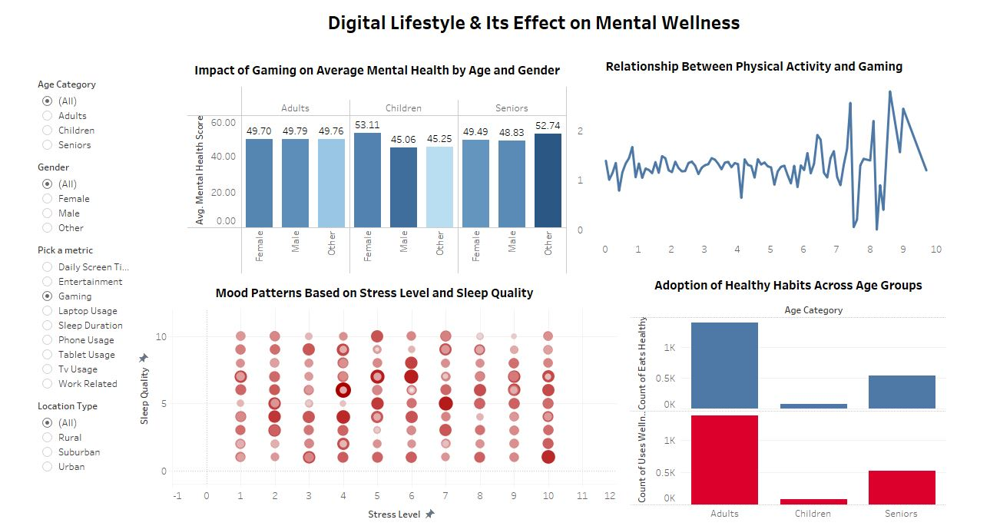

# 🧠 Digital Habits & Mental Health – Data Analysis Project

## 📁 Project Overview
This project explores the relationship between digital device usage and mental health. Using Python for data cleaning and Tableau for visualization, we analyze how screen time, lifestyle choices, and wellness habits affect mental well-being across age groups and genders.

---

## ⚙️ Step-by-Step Workflow

### 1. 🧹 Data Cleaning with Python
- Loaded the dataset from an Excel/CSV file using `pandas`.
- Identified and handled missing values.
- Categorized `age` into:
  - Children (≤14)
  - Adults (15–50)
  - Seniors (>50)
- Created a new `age_category` column.
- Exported the cleaned data to a new CSV for use in Tableau.

### 2. 📊 Data Visualization with Tableau
- Built interactive dashboards to explore the relationship between mental health and digital/lifestyle habits.
- Implemented dynamic filtering by demographics (age group, gender).
- Used calculated fields and parameters for flexible metric selection and comparison.

---

## 🔍 Key Insights
- **Adults** report the **highest stress** and **lowest sleep quality**.
- **Higher physical activity** correlates with better **mood and mental health**.
- Individuals who **eat healthy** and **use wellness apps** report better well-being.
- **Increased screen time**, especially on phones and social media, is linked to **lower mood ratings**.
- **Sleep quality** and **stress levels** are strongly correlated with overall mental wellness.

👉 **View the live dashboard:**  
[🔗 Tableau Public Link](https://public.tableau.com/views/DigitalLifestyleItsEffectonMentalWellness/Dashboard1?:language=en-GB&:sid=&:redirect=auth&:display_count=n&:origin=viz_share_link)

---

## 🛠️ Tools Used
- **Python (`pandas`)** – Data preprocessing and cleaning  
- **Tableau Desktop** – Data visualization and dashboard creation

---

## 📷 Dashboard Preview  

---

## 📂 Files Included
- `digital_diet_mental_health.py` – Python script used to clean the data  
- `cleaned_data.csv` – Final cleaned dataset for Tableau  
- `Tech-Mental-Analysis.twb` – Tableau workbook with dashboards

---

## 📬 Contact  
Feel free to connect with me on [LinkedIn](https://www.linkedin.com/in/maheen-khalid-38a0591b0/).
